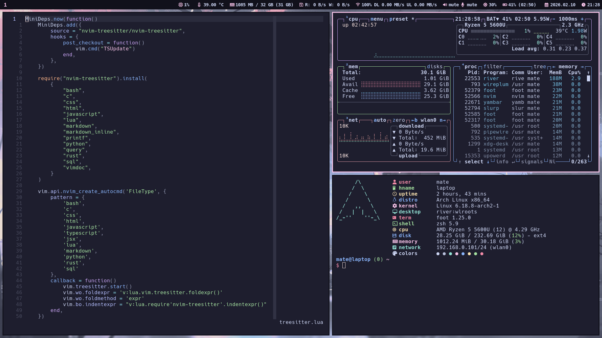

# configs

Personal system-wide and user-specific configuration files for Arch Linux.



# Quick Links

- [Packages](#packages)
- [Enabled services](#enabled-services)
- [Setup commands](#setup-commands)
- [Manual setup](#manual-setup)

## System Core

- **Kernel & Firmware**: linux, linux-firmware, amd-ucode
- **Base System**: base, base-devel, polkit, systemd-resolvconf, zram-generator

## Hardware Support

- **Bluetooth**: bluez, bluez-utils
- **Audio**: pipewire, wireplumber, sof-firmware
- **Graphics**: mesa, lib32-mesa, vulkan-radeon
- **Utilities**: brightnessctl

## Networking

- **Core**: iwd
- **Tools**: openssh, sshpass, wireguard-tools, lftp

## Display & UI

- **Compositor**: river
- **Display Management**: wlr-randr
- **Compatibility**: qt6-wayland, xdg-desktop-portal, xdg-desktop-portal-wlr
- **Fonts**: ttf-hack-nerd, noto-fonts-emoji
- **Visuals**: wbg (AUR), yambar (AUR)

## Terminal

- **Emulator**: foot
- **Shell Enhancements**: bash-completion, fzf, zoxide
- **System Monitoring**: btop, fastfetch
- **pacman Utilities**: pacutils, pacman-contrib, reflector


## Core Applications
- **Browser**: firefox
- **File Management**: atool, unrar, zip, unzip, ntfs-3g, e2fsprogs
- **Screenshots/Clipboard**: grim, slurp, wl-clipboard

## Gaming
- **Platforms**: steam, prismlauncher
- **Compatibility**: wine, wine-mono, wine-gecko, protontricks
- **Optimization**: gamemode

## Development Tools

- **Version Control**: git
- **Debugging/Profiling**: valgrind, gdb, perf
- **Containerization**: docker, docker-compose
- **Editor**: neovim, tree-sitter-cli
- **Utilities**: scc-bin (AUR), aichat, man-db, man-pages

## Language Support
- **C/C++**: clang
- **Java**: jdk-openjdk
- **JavaScript/TypeScript**: nodejs, npm, typescript-language-server, vscode-css-languageserver, vscode-html-languageserver
- **Lua**: lua, stylua
- **Python**: python, uv, pyright, jupyter-notebook
- **Rust**: rustup
- **LaTeX**: texlive, texlive-langeuropean, biber, texlab

## System Services (system level)

### Core System

- **getty@.service** - Terminal getty (login prompts)

### Network

- **iptables.service** / **ip6tables.service** - Firewall rules
- **iwd.service** - Wireless daemon
- **systemd-resolved.service** - DNS resolver

### Time & Scheduling

- **systemd-timesyncd.service** - NTP time synchronization
- **fstrim.timer** - SSD TRIM optimization
- **paccache.timer** - Pacman cache cleaning
- **reflector.timer** - Mirror list updating

### Systemd Infrastructure

- **systemd-resolved-monitor.socket** / **systemd-resolved-varlink.socket** - DNS resolver sockets
- **systemd-userdbd.socket** - User database service socket

## User Services (--user level)

### Audio

- **pipewire.service** / **pipewire.socket** - Multimedia framework
- **wireplumber.service** - Session/policy manager for PipeWire

### Desktop Integration

- **xdg-user-dirs.service** - User directory management

# Setup commands

```bash
ln -sf /usr/share/zoneinfo/Europe/Budapest /etc/localtime
hwclock --systohc
locale-gen
passwd --lock root
xdg-user-dirs-update
useradd -m -G wheel -G gamemode -G docker mate
passwd mate
ln -s ~/.config/mimeapps.list ~/.local/share/applications/mimeapps.list
su postgres
initdb -D /var/lib/postgres/data
```

# Maual setup

## Firefox

- Search engines
- Extensions
