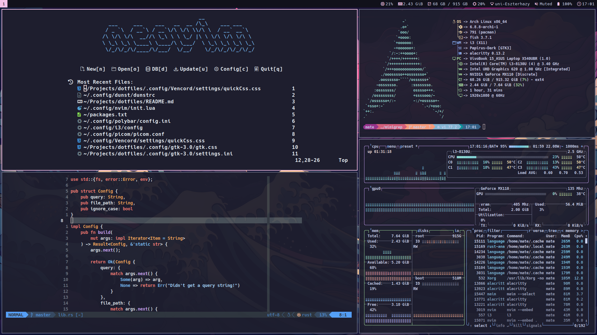

</img>
# Packages (803)  
## i3wm  
Core: i3-wm  
Server: xorg-server  
Init: xorg-xinit  
Compositor: picom  
Layout: i3-layouts (AUR)  
Launcher: rofi  
Bar: polybar  
Wallpaper: feh  
Screenshot: maim  
Notifications: dunst  
## IO settings  
Display: xorg-xrandr, brightnessctl  
Graphics card driver: nvidia, nvidia-utils, nvidia-settings  
Bluetooth: bluez, bluez-utils  
Volume: pulsemixer  
Mouse: xorg-xinput  
## Terminal  
Shell: fish  
Terminal: alacritty  
Fetch: fastfetch  
Prompt: starship  
Task manager: btop  
Clipboard: xclip  
Text editor: micro  
Font: ttf-hack-nerd  
Version control: git  
ls replacament: exa  
cd replacement: zoxide, fzf  
## Development  
Editor: code 
AMPP: XAMPP (Official website)  
Network: packettracer (AUR)
Database planning: mysql-workbench
Game development: unityhub (AUR)  
### VS Code Extensions  
ms-dotnettools.vscode-dotnet-runtime  
muhammad-sammy.csharp  
llvm-vs-code-extensions.vscode-clangd  
streetsidesoftware.code-spell-checker  
Codeium.codeium  
ecmel.vscode-html-css  
abusaidm.html-snippets  
xabikos.JavaScriptSnippets  
yandeu.five-server  
Oracle.oracledevtools  
bmewburn.vscode-intelephense-client  
ms-python.python  
sguerri.simple-hide-files  
#### Theme, icon  
Theme: enkia.tokyo-night  
Icons: vscode-icons-team.vscode-icons  
### Tools  
cmake  
valgrind  
dotnet-runtime  
dotnet-sdk  
jdk-openjdk  
php  
## Apps  
Explorer: nemo  
Browser: firefox  
Archived files: nemo-fileroller  
Office suite: libreoffice-fresh  
Image editor: gimp  
Video recorder: obs-studio  
Video editor: shotcut  
Torrent: qbittorrent  
PDF reader: zathura, zathura-pdf-mupdf  
Calculator: speedcrunch  
Note taking: obsidian  
Media player: vlc  
Cloud sync: rclone  
VPN: openvpn  
## Other stuff  
Compatibility: wine  
Emoji font: noto-fonts-emoji  
Gaming: steam  
Music: cider (AUR), nvm (AUR)  
GTK Theme: catppuccin-gtk-theme-mocha (AUR)  
Papirus folders: papirus-folders-catppuccin-git (AUR)  
Custom discord: vencord (Official site)  
# Manual setup  
Change shell to fish  
Turn fish greeting off  
Make .aur directory  
Make Desktop, Downloads, Documents, Pictures, Videos, Music, University, Work, Projects, .path directories  
Set cinnamon default terminal for nemo (gsettings set org.cinnamon.desktop.default-applications.terminal exec alacritty)  
Remove unused .desktop files from /usr/share/applications and rename some  
.ssh folder config  
Set up symbolic links to /opt/lampp/htdocs  
git: config (user.email, user.name, credential.helper)  
rclone: config  
Wine: wine mono  
Firefox: login, always show bookmarks, customize toolbar, login to every site  
Code: Codeium, git, extensions, UI  
Discord: login, font size, Vencord CustomCSS  
Cider: login, theme  
Obsidian: theme, set up vaults  
LibreOffice: disable tips  
Packet Tracer: download installer from official site  
Steam: login  
